# Vector Database Migration Strategy

## Overview

LocalMind's engine architecture is well-architected with a solid 10-step pipeline in `engine.py`, sophisticated 4-factor memory scoring in `MemoryComposer`, and an effective deduplication gate in `VectorStore`. The current weak point is precisely what this strategy addresses: the storage layer in `storage/vector.py` uses ChromaDB, which introduces unnecessary complexity and performance bottlenecks.



## Current Architecture Analysis

### Strengths
- **10-step processing pipeline** in engine.py provides robust intent resolution and context building
- **4-factor memory scoring**: similarity × 0.6 + recency × 0.2 + importance × 0.1 + frequency × 0.1
- **Deduplication gate** prevents redundant memory storage with distance < 0.15 threshold
- **Clean abstraction layer** in VectorStore with well-defined interface methods

### Current Limitations
- **ChromaDB cold-start problem**: 10-30 second embedding load delays on short greetings
- **Hidden complexity**: Separate service requiring additional dependencies and configuration
- **Storage fragmentation**: ChromaDB directory alongside SQLite database
- **Performance overhead**: Additional service layer between application and vector storage

## Migration Strategy



### Target Architecture: SQLite + sqlite-vec

The migration targets a unified storage approach using SQLite with the sqlite-vec extension, providing:

- **Single file database** for both structured data and vector embeddings
- **ACID guarantees** for data consistency
- **Zero cold-start delay** - extension loads with existing SQLite connection
- **Full schema control** with native SQL operations
- **Optional FAISS integration** for high-performance indexing when needed

## Implementation Plan

### Phase 1: VectorStore Interface Migration

The `VectorStore` class maintains a clean, well-defined interface that requires only these methods to be reimplemented:

```python
# Core interface methods to implement
- store(content: str, metadata: dict) -> str
- recall_with_scores(query: str, limit: int) -> List[Tuple[str, float]]
- forget(memory_id: str) -> bool
- list_all_with_metadata() -> List[dict]
- count() -> int
```

### Phase 2: Storage Layer Changes

#### What to Remove
- `chromadb` import and `PersistentClient` initialization
- `get_or_create_collection()` calls
- Separate `chroma_db/` directory management
- ChromaDB-specific configuration and connection handling

#### What to Add
- sqlite-vec extension loading alongside existing SessionStore connection
- vec0 virtual table creation with appropriate embedding dimensions
- Direct Ollama embedding integration for vector generation
- Unified database schema within `localmind.db`

#### What to Preserve
- **Identical VectorStore API** - no changes to calling code
- **Deduplication gate logic** with same distance thresholds
- **Memory scoring algorithms** in MemoryComposer
- **All existing metadata handling** (session_id, timestamp, importance, memory_type)

### Phase 3: Data Migration

1. **Export existing ChromaDB data** with all metadata
2. **Create sqlite-vec virtual table** with matching embedding dimensions (768 or 4096 depending on Ollama model)
3. **Import and validate data integrity**
4. **Update configuration** to remove `chroma_db/` path references
5. **Testing and validation** of memory operations

## Technical Benefits

### Performance Improvements
- **Eliminate cold-start delays** - sqlite-vec loads with SQLite connection
- **Reduce memory footprint** - no separate ChromaDB service
- **Improve query latency** - direct SQL operations vs HTTP/service calls
- **Better resource utilization** - single database connection pool

### Operational Benefits
- **Simplified deployment** - one database file instead of database + ChromaDB
- **Easier backups** - single file backup strategy
- **Reduced dependencies** - fewer external services to manage
- **Better observability** - native SQLite performance metrics

### Development Benefits
- **Schema control** - full SQL schema definition and migration control
- **Testing simplicity** - easier to set up test environments
- **Debugging capabilities** - direct SQL access to vector data
- **Flexibility** - easier to add custom metadata or scoring functions

## Migration Timeline

### Week 1: Preparation
- Set up development environment with sqlite-vec
- Create migration scripts for existing data
- Implement VectorStore interface changes

### Week 2: Implementation
- Complete storage/vector.py rewrite
- Add comprehensive testing suite
- Performance benchmarking against ChromaDB

### Week 3: Validation & Deployment
- Data migration validation
- Integration testing with full system
- Production deployment with rollback plan

## Risk Mitigation

### Technical Risks
- **Data loss**: Implement comprehensive backup and validation procedures
- **Performance regression**: Benchmark against current ChromaDB performance
- **Embedding dimension mismatch**: Validate model compatibility before migration

### Operational Risks
- **Service disruption**: Plan migration during low-usage periods
- **Rollback complexity**: Maintain ChromaDB compatibility during transition
- **Team unfamiliarity**: Document sqlite-vec patterns and best practices

## Success Metrics

- **Zero data loss** during migration
- **Improved cold-start performance** (target: < 1 second vs current 10-30 seconds)
- **Reduced memory usage** (target: 30% reduction in overall memory footprint)
- **Simplified deployment** (target: single database file deployment)
- **Maintained or improved query performance** for memory recall operations

## Next Steps

1. **Confirm embedding dimensions** for current Ollama model configuration
2. **Set up sqlite-vec development environment**
3. **Create data migration scripts** for existing ChromaDB content
4. **Begin VectorStore interface implementation**
5. **Establish performance benchmarks** for comparison

This migration represents a strategic simplification of LocalMind's storage architecture while maintaining all existing functionality and improving performance characteristics. The clean interface design of VectorStore makes this a low-risk, high-impact improvement to the system's foundation.
